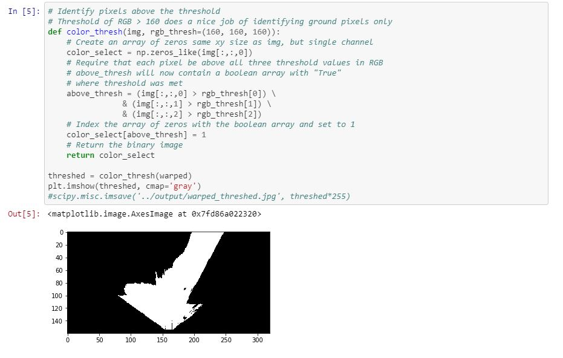
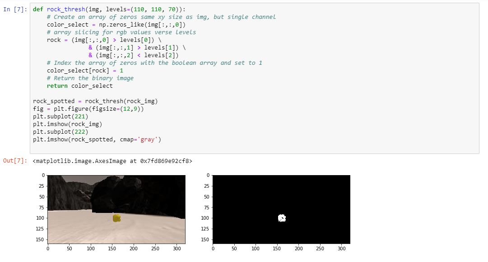
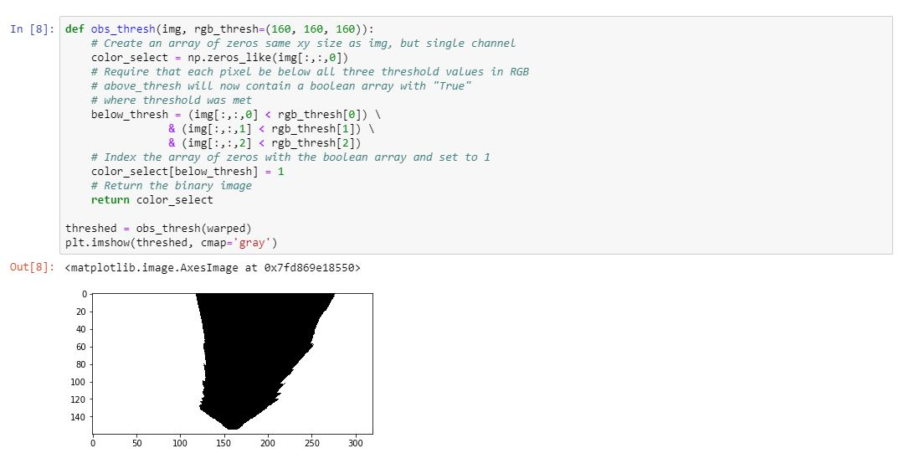
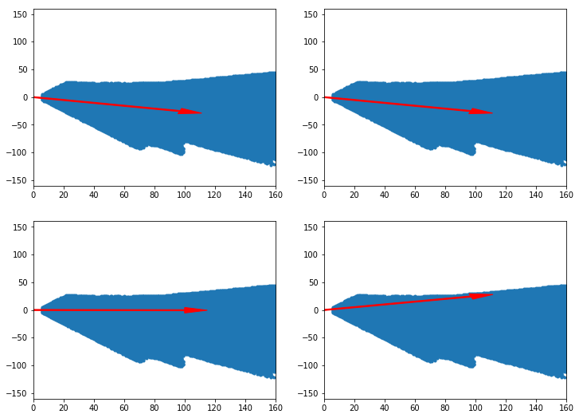
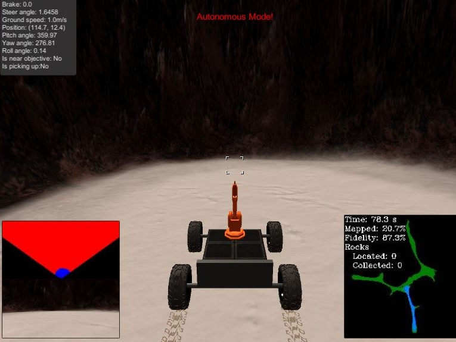
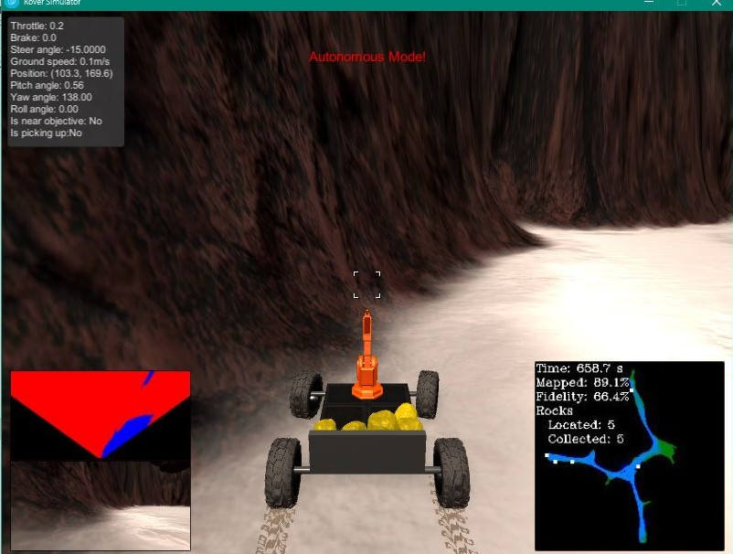
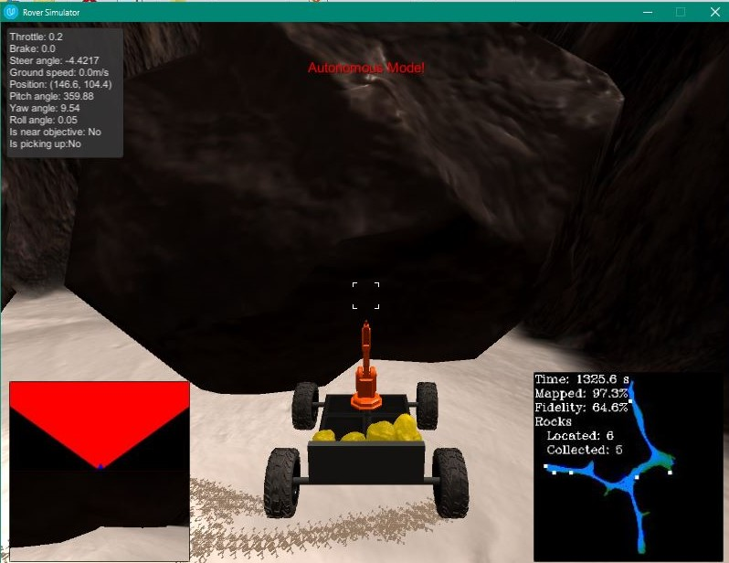
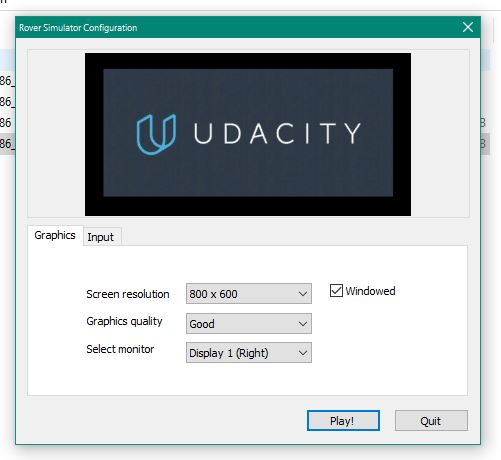

## Project: Search and Sample Return
### Writeup Template: You can use this file as a template for your writeup if you want to submit it as a markdown file, but feel free to use some other method and submit a pdf if you prefer.

---

**The goals / steps of this project are the following:**  

**Training / Calibration**  

* Download the simulator and take data in "Training Mode"
* Test out the functions in the Jupyter Notebook provided
* Add functions to detect obstacles and samples of interest (golden rocks)
* Fill in the `process_image()` function with the appropriate image processing steps (perspective transform, color threshold etc.) to get from raw images to a map.  The `output_image` you create in this step should demonstrate that your mapping pipeline works.
* Use `moviepy` to process the images in your saved dataset with the `process_image()` function.  Include the video you produce as part of your submission.

**Autonomous Navigation / Mapping**

* Fill in the `perception_step()` function within the `perception.py` script with the appropriate image processing functions to create a map and update `Rover()` data (similar to what you did with `process_image()` in the notebook). 
* Fill in the `decision_step()` function within the `decision.py` script with conditional statements that take into consideration the outputs of the `perception_step()` in deciding how to issue throttle, brake and steering commands. 
* Iterate on your perception and decision function until your rover does a reasonable (need to define metric) job of navigating and mapping.  

## [Rubric](https://review.udacity.com/#!/rubrics/916/view) Points
### Here I will consider the rubric points individually and describe how I addressed each point in my implementation.  

---
### Writeup / README

#### 1. Provide a Writeup / README that includes all the rubric points and how you addressed each one.  You can submit your writeup as markdown or pdf.  

You're reading it!

### Notebook Analysis
#### 1. Run the functions provided in the notebook on test images (first with the test data provided, next on data you have recorded). Add/modify functions to allow for color selection of obstacles and rock samples.

Two functions related to the color_thresh() function were added to identify the rocks and obstacles:

1- rock_threshed(img, levels =(110,110,70)) Target's pixels that are greater than 110 in the red//green channels and less than 70 in the blue channel. If this is true of a pixel than it will be an added pixel to determine found rocks. 

2- obs_thresh(img, rgb_thresh=(160,160,160)) Takes the inverse values used for color_thresh to isolate obstacles instead of the navigable terrain. Target's pixels that are less than than 160 in the red//green//blue.

#### 1. Populate the `process_image()` function with the appropriate analysis steps to map pixels identifying navigable terrain, obstacles and rock samples into a worldmap.  Run `process_image()` on your test data using the `moviepy` functions provided to create video output of your result. 

The lab culminated in the output of a moviepy from the process_image() function. It consisted of calling functions developed in the classroom exercies and initalizing the proper variables to allow the functions to run. See the process_image() code below for more details:

    # 1) Define source and destination points for perspective transform
    # Set a bottom offset to account for the fact that the bottom of the image 
    dst_size = 5
    bottom_offset = 6
    source = np.float32([[14, 140], [301 ,140],[200, 96], [118, 96]])
    destination = np.float32([[image.shape[1]/2 - dst_size, image.shape[0] - bottom_offset],
                  [image.shape[1]/2 + dst_size, image.shape[0] - bottom_offset],
                  [image.shape[1]/2 + dst_size, image.shape[0] - 2*dst_size - bottom_offset], 
                  [image.shape[1]/2 - dst_size, image.shape[0] - 2*dst_size - bottom_offset],
                  ])
    # 2) Apply perspective transform
    warped, mask = perspect_transform(img, source, destination)
    # 3) Apply color threshold to identify navigable terrain/rock samples
    threshed = color_thresh(warped)
    obs_map = np.absolute(np.float32(threshed)-1) * mask
    # 4) Convert thresholded image pixel values to rover-centric coords
    xpix, ypix = rover_coords(threshed)
    obsxpix, obsypix = rover_coords(obs_map)  
    # 5) define proper variables for plotting the pixels to the world
    world_size = data.worldmap.shape[0]
    scale = 2 * dst_size
    xpos = data.xpos[data.count]
    ypos = data.ypos[data.count]
    yaw = data.yaw[data.count]
    # 6) Convert rover-centric pixel values to world coord
    x_world, y_world = pix_to_world(xpix, ypix, xpos, ypos, yaw, world_size, scale)
    obs_x_world, obs_y_world = pix_to_world(obsxpix, obsypix, xpos, ypos, yaw, world_size, scale) 
    # 7) Display the navigable pixels in blue and the obstacle pixels in red  
    data.worldmap[y_world, x_world,2] = 255
    data.worldmap[obs_y_world,obs_x_world,0] = 255
    # 8) zero out obstacle pixels that overlap with navigable pixels 
    nav_pix = data.worldmap[:,:,2] > 0
    data.worldmap[nav_pix,0] = 0
    rock_map = rock_thresh(warped, levels =(110,110,50))
    # 9) check for rocks 
    if rock_map.any():
        # Convert rock image pixel values to rover-centric coords
        rock_x,rock_y = rover_coords(rock_map)
        #
        rock_x_world,rock_y_world = pix_to_world(rock_x,rock_y,xpos,ypos,yaw,world_size,scale)
        # display rock pixels in blue
        data.worldmap[rock_y_world,rock_x_world,:] = 255     
    # 10) Make a mosaic image
    output_image = np.zeros((img.shape[0] + data.worldmap.shape[0], img.shape[1]*2, 3))
    output_image[0:img.shape[0], 0:img.shape[1]] = img
    # Add the warped image in the upper right hand corner
    output_image[0:img.shape[0], img.shape[1]:] = warped
    # Overlay worldmap with ground truth map
    map_add = cv2.addWeighted(data.worldmap, 1, data.ground_truth, 0.5, 0)
    # Flip map overlay so y-axis points upward and add to output_image 
    output_image[img.shape[0]:, 0:data.worldmap.shape[1]] = np.flipud(map_add)

    

### Autonomous Navigation and Mapping

#### 1. Fill in the `perception_step()` (at the bottom of the `perception.py` script) and `decision_step()` (in `decision.py`) functions in the autonomous mapping scripts and an explanation is provided in the writeup of how and why these functions were modified as they were.

#### 2. Launching in autonomous mode your rover can navigate and map autonomously.  Explain your results and how you might improve them in your writeup. 

1- Navigating autonoumously: Moved the process_image() and rock_thresh() function from the lab into the precetion_step() and generated a new function in the perception.py for thresholding the rocks: 

    def perception_step(Rover):
        
        # 1) Define source and destination points for perspective transform
        dst_size = 5
     
        # Set a bottom offset to account for the fact that the bottom of the image 
        # is not the position of the rover but a bit in front of it
        # this is just a rough guess, feel free to change it!
        bottom_offset = 6
        image = Rover.img
        source = np.float32([[14, 140], [301 ,140],[200, 96], [118, 96]])
        destination = np.float32([[image.shape[1]/2 - dst_size, image.shape[0] - bottom_offset],
                  [image.shape[1]/2 + dst_size, image.shape[0] - bottom_offset],
                  [image.shape[1]/2 + dst_size, image.shape[0] - 2*dst_size - bottom_offset], 
                  [image.shape[1]/2 - dst_size, image.shape[0] - 2*dst_size - bottom_offset],
                  ])
        # 2) Apply perspective transform
        warped, mask = perspect_transform(Rover.img, source, destination)
        # 3) Apply color threshold to identify navigable terrain/rock samples
        threshed = color_thresh(warped)
        obs_map = np.absolute(np.float32(threshed)-1) * mask
        # 4) Update Rover.vision_image(this will be displayed at the left side of the screen)
        Rover.vision_image[:,:,2] = threshed * 255
        Rover.vision_image[:,:,0] = obs_map * 255
        # 5) Convert thresholded image pixel values to rover-centric coords
        xpix, ypix = rover_coords(threshed)
        # 6) Convert rover-centric pixel values to world coords
        world_size = Rover.worldmap.shape[0]
        scale = 2*dst_size
        x_world, y_world = pix_to_world(xpix, ypix, Rover.pos[0], Rover.pos[1],Rover.yaw, world_size, scale)
       
        obsxpix, obsypix = rover_coords(obs_map)
        obs_x_world, obs_y_world = pix_to_world(obsxpix, obsypix, Rover.pos[0], Rover.pos[1],Rover.yaw, world_size, scale)

        # 7) Update worldmap (to be displayed on right side of screen)
        Rover.worldmap[y_world, x_world,2] += 10
        #Rover.worldmap[obs_y_world,obs_x_world,0] += 1

        # 8) Convert Rover-centric pixel positions to polar coordinates
        dist, angles = to_polar_coords(xpix,ypix)
        # Update Rover pixel distances and angles 
        # Rover.nav_dists = rover_centric_pixel_distances
        # Rover.nav_angles = rover_centric_angles
        Rover.nav_angles = angles + 0.05 # change the angle to hug the wall on the left hand side 
        #print(Rover.nav_angles)
   
        # look for rocks
        rock_map = rock_thresh(warped, levels =(110,110,50))
        if rock_map.any():
            Rover.rock_map = True
            rock_x,rock_y = rover_coords(rock_map)
            rock_x_world,rock_y_world = pix_to_world(rock_x,rock_y,Rover.pos[0], Rover.pos[1],Rover.yaw,world_size,scale)

            rock_dist, rock_ang = to_polar_coords(rock_x,rock_y)
            Rover.rock_angles = rock_ang
            rock_idx = np.argmin(rock_dist)
            rock_xcen = rock_x_world[rock_idx]
            rock_ycen = rock_y_world[rock_idx]
            Rover.worldmap[rock_ycen,rock_xcen,1] = 255
            #print(Rover.rock_angles) 
            #Rover.vision_image[:,:,1] = 255
        else:
            Rover.vision_image[:,:,1] = 0
            Rover.rock_map = False
    

        return Rover

2- Spots a Rock and Picks up a rock:

   drive_rover.py 
  
       self.rock_map = False # create a rock_map boolean and set to false
       
   perception.py 
  
        # if a rock is spotted set the rock_map image to True
        if rock_map.any(): 
            Rover.rock_map = True
            
   decision.py 
        
        # if a rock is spotted steer towards the rock and slow down the rover to vel = 0.2
        if Rover.rock_map == True:
                rock_pos = Rover.rock_angles
                Rover.steer = np.clip(np.mean(rock_pos * 180/np.pi),-15,15)
                Rover.vel = 0.2
                # if the rover is near a sample and the velocity is greater than 0 stop and pick up the rock
                if Rover.near_sample and Rover.vel > 0 and not Rover.picking_up:
                    Rover.brake = Rover.brake_set
                    Rover.send_pickup = True
        
3- Holding the wall and experimenting with the angles in which the rover drives in order to keep from repeating terrain:

   a. Experimented with the average angle of the rover in the lab and ... Still needs some tweaking (got stuck a lot more at first.             Found that slowing down the rover and a small angle helped deal with this step
 
 
 
   b.deployed the in the perception.py pereception_step()
   
   perception.py
   
        Rover.nav_angles = angles + 0.05

4- Getting Stuck. Th rover got stuck quite a bit.Escpecially when attemoting to hold the wall. In order to keep this from occuring I would record the stop time and attempt the rotate the rover every certain amount of frames.

  drive_rover.py 
  
       self.stuck_time = 0
       
  decision.py   
        
       if Rover.vel <= 0.2:
                # Now we're stopped, lets keep count of the time we were stuck
                Rover.stuck_time += 1
                print(Rover.stuck_time)
                
       # if we are stuck and not going over 0.2 vel, every 25 frames rotate the rover
       if Rover.vel < 0.2 and Rover.stuck_time % 25 == 0:
                 Rover.throttle = 0
                 # Release the brake to allow turning
                 Rover.brake = 0
                 # Turn range is +/- 15 degrees, when stopped the next line will induce 4-wheel turning
                 Rover.steer = -15     
        

5- Some results along the way 

6- Things to finesse. With more time it would be fun to investigate the logic to return home and work on a more sophisticated data structure to deal with the steering, forward, stop, picking up a rock, being stuck, and etc... It is also apparent that things like map fidelity and the steering angle could be tweaked for better overall performance.
                        
**Note: running the simulator with different choices of resolution and graphics quality may produce different results, particularly on different machines!  Make a note of your simulator settings (resolution and graphics quality set on launch) and frames per second (FPS output to terminal by `drive_rover.py`) in your writeup when you submit the project so your reviewer can reproduce your results.**

